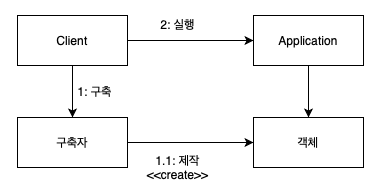
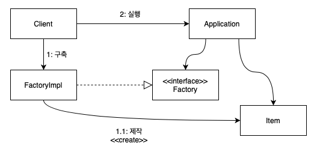
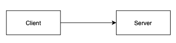
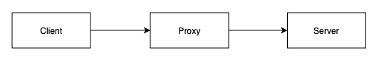
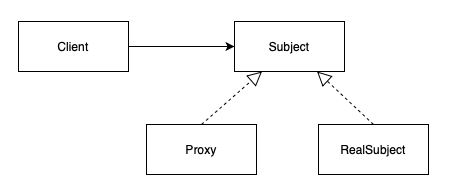
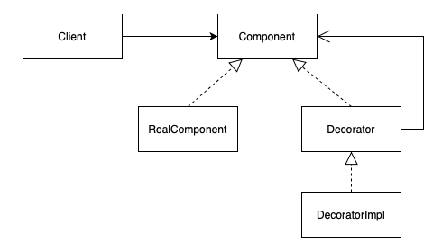

# 11장 시스템

커다란 시스템을 구축한다는것은 도시를 세우는것에 비유할 수 있다. 혼자서 구체적인 모든 것을 알 필요 없이 적절한 추상화화 모듈화를 적용시켜서 구성한다. 

## 시스템 제작과 시스템 사용의 분리

다시 말하면 시스템의 비즈니스 로직을 구현하는 부부분에서는 사용할 객체의 생성이나 필요한 객체의 의존성 연결에 관한 것을 신경쓰지 않아야 한다는 것이다.

### Main 분리

(Client = Main)



- 필요한 객체의 생성을 메인 또는 메인이 호출하는 구축자 모듈이 담당한다.
- 생성된 객체를 어플리케이션에 넘긴다.
- 어플리케이션은 주입된 객체를 사용한다.

어플리케이션을 구현할 때는 메인이나 메인에서 만들 객체의 생성에 대해 전혀 관심 가지지 않는다.

### 팩토리



객체의 생성 시점을 어플리케이션이 결정해야 할 때는 추상 팩토리 패턴을 사용한다.

- 아이템의 생성 시점은 어플리케이션이 결정한다.
- 아이템 생성 코드는 어플리케이션 외부 (FactoryImpl)에 있기 때문에 어플리케이션은 모른다.
- 수정에 닫혀있고 확장에 열려있다. (OCP)
- 클래스 개수가 늘어난다.

### 의존성 주입 (DI)

클래스가 의존성을 해결하는 어떠한 방법도 시도하지 않고 수동적으로 생성자를 통하거나 setter 메서드를 통해 필요한 객체를 주입받는다. 

스프링 프레임워크를 사용하면 더욱 편리하게 DI를 해결할 수 있다. 객체 생성부터 소멸까지의 생명주기 관리를 개발자가 아닌 스프링이 대신 해주기 때문에 제어관계가 역전 되었다고 하여 IoC (Inversion of Control) 컨테이너 라고도 불린다.

## 크로스 커팅 (cross-cuttin)

```java
public abstract class Bank implements javax.ejb.EntityBean {
    // 비즈니스 논리...
    public abstract String getStreetAddr1();
    public abstract String getStreetAddr2();
    public abstract String getCity();
    public abstract String getState();
    public abstract String getZipCode();
    public abstract void setStreetAddr1(String street1);
    public abstract void setStreetAddr2(String street2);
    public abstract void setCity(String city);
    public abstract void setState(String state);
    public abstract void setZipCode(String zip);
    public abstract Collection getAccounts();
    public abstract void setAccounts(Collection accounts);

    public void addAccount(AccountDTO accountDTO) {
        InitialContext context = new InitialContext();
        AccountHomeLocal accountHome = context.lookup("AccountHomeLocal");
        AccountLocal account = accountHome.create(accountDTO);
        Collection accounts = getAccounts();
        accounts.add(account);
    }

    // EJB 컨테이너 논리
    public abstract void setId(Integer id);
    public abstract Integer getId();
    public Integer ejbCreate(Integer id) { ... }
    public void ejbPostCreate(Integer id) { ... }

    // 나머지도 구현해야 하지만 일반적으로 비어있다.
    public void setEntityContext(EntityContext ctx) {}
    public void unsetEntityContext() {}
    public void ejbActivate() {}
    public void ejbPassivate() {}
    public void ejbLoad() {}
    public void ejbStore() {}
    public void ejbRemove() {}
}
```

*(EJB 스타일의 엔티티 코드)*

- EJB 를 사용하면 비즈니스 로직이 EJB에 강하게 결합된다.
- 클래스가 EJB 컨테이너에서 파생해야 하며 EJB가 요구하는 라이프 사이클 메서드를 제공해야 한다.
- 독자적인 테스트가 어렵다.

이런 단점들에도 불구하고 EJB 아키텍처는 일부 영역에서 관심사를 분리하였다. DB 트랜잭션, 보안, 영속성 관리 등의 동작을 소스 코드 외부의 XML 로 분리하였다. → AOP 방법론

### 프록시



일반적인 상황에서는 클라이언트가 서버를 직접 호출한다.



그런데 서버를 직접 호출하는 대신 프록시라는 대리자가 호출하도록 간접적으로 요청할 수도 있다.

프록시를 두면 접근 제어나 부가 기능을 수행할 수 있다.

단 런타임에는 클라이언트가 프록시를 사용하지만 컴파일 타임에는 클라이언트가 바라보는 객체가 프록시 인지 서버인지 몰라야 한다.

### 프록시 패턴

접근 제어가 목적

- 권한에 따른 접근 차단
- 캐싱
- 지연 로딩



### 데코레이터 패턴

새로운 부가 기능 수행이 목적

- 로깅
- 요청 값, 응답 값 변형



### 자바 프록시

```java
// Bank.java 
import java.utils.*;

// The abstraction of a bank.
public interface Bank {
    Collection<Account> getAccounts();
    void setAccounts(Collection<Account> accounts);
}

// BankImpl.java
import java.utils.*;

// 추상화를 위한 POJO
public class BankImpl implements Bank {
    private List<Account> accounts;

    public Collection<Account> getAccounts() {
        return accounts;
    }
    
    public void setAccounts(Collection<Account> accounts) {
        this.accounts = new ArrayList<Account>();
        for (Account account: accounts) {
            this.accounts.add(account);
        }
    }
}
// BankProxyHandler.java
import java.lang.reflect.*;
import java.util.*;

// 프록시 API가 필요한 “InvocationHandler”
public class BankProxyHandler implements InvocationHandler {
    private Bank bank;
    
    public BankHandler (Bank bank) {
        this.bank = bank;
    }
    
    // InvocationHandler에 정의된 메서드
    public Object invoke(Object proxy, Method method, Object[] args) throws Throwable {
        String methodName = method.getName();
        if (methodName.equals("getAccounts")) {
            bank.setAccounts(getAccountsFromDatabase());
            
            return bank.getAccounts();
        } else if (methodName.equals("setAccounts")) {
            bank.setAccounts((Collection<Account>) args[0]);
            setAccountsToDatabase(bank.getAccounts());
            
            return null;
        } else {
            ...
        }
    }
    
    // 세부사항
    protected Collection<Account> getAccountsFromDatabase() { ... }
    protected void setAccountsToDatabase(Collection<Account> accounts) { ... }
}

// 다른 곳에 위치한 코드
Bank bank = (Bank) Proxy.newProxyInstance(
    Bank.class.getClassLoader(),
    new Class[] { Bank.class },
    new BankProxyHandler(new BankImpl())
);
```

추가적인 복잡한 코드가 필요하므로 프록시를 사용하여 깨끗한 코드를 작성하기는 어렵다.

## 결론

- 깨끗하지 못한 아키텍처는 도메인 논리를 흐리고 품질을 떨어뜨린다.
- 모든 추상화 단계에서 명확한 의도를 표현해야 한다.
    - 그러기 위해 POJO를 작성하고 AOP 등을 통해 관심사를 분리해야 한다.