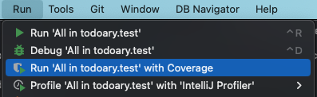
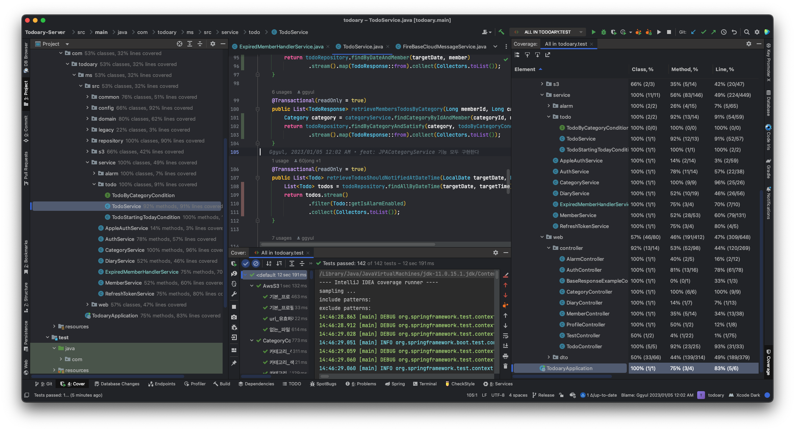
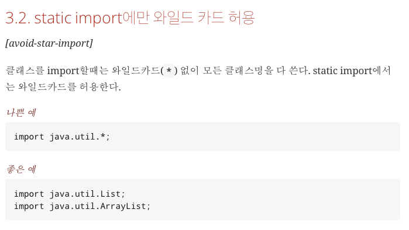
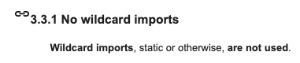

# 16장. SerialDate 리팩터링

어떻게 리팩터링하는지 흐름은 책을 보는 게 낫습니다. 리팩터링하면서 적용한 휴리스틱만 간단하게 정리하겠습니다.

## 목차

* [SerialDate](#SerialDate)
* [첫째. 돌려보자](#-------)
* [둘째. 고쳐보자](#-------)
  + [코드를 보고 예상되는 건 구현해야 한다 [G2]](#-----------------------g2-)
  + [경계 처리는 똑바로 하자 [G3] 그리고 테스트하자 [T5]](#---------------g3-------------t5-)
  + [또 버그가 나서 수정했다면, 그 주변도 철저히 테스트하자. 버그는 서로 모이는 경향이 있다. [T6]](#---------------------------------------------------t6-)
  + [긴 import 목록 대신 와일드카드를 사용하자 [J1]](#--import--------------------j1-)
  + [이름을 지을 때는 추상화된 수준에 맞춰서 이름을 짓자 [N2]](#-------------------------------n2-)
  + [추상화 수준을 올바르게 해라 [G6]](#-----------------g6-)
  + [일반적으로 부모가 자식 클래스를 몰라야 바람직하다. [G7]](#-----------------------------g7-)
  + [흔히 쓰는 명명법을 사용하자 [N3]](#-----------------n3-)
  + [정수 상수보다 enum을 사용하자 [J3]](#--------enum--------j3-)
  + [죽은 코드는 지우자 [G9]](#------------g9-)
  + [호출되는 곳에 가까이 선언하자 [G10]](#------------------g10-)
  + [쓸데없는 걸 적지 말자. [G12]](#--------------g12-)
  + [무관한 개념(클래스, 함수 등)을 서로 결합하지 마라 [G13]](#-------------------------------g13-)
  + [다른 객체를 조작하지 말자. [G14]](#----------------g14-)
  + [메서드에 플래그(선택자) 넘기지 말 것 [G15]](#-----------------------g15-)
  + [static 함수는 고민해보자. 기본은 인스턴스 메서드다. [G18]](#static--------------------------g18-)
  + [알고리즘이 복잡하면 임시 변수 설명을 사용하자 [G19]](#---------------------------g19-)
  + [이름과 기능이 일치하는 함수를 만들자 [G20]](#----------------------g20-)
  + [대충 돌아가면 완성하지 말고 알고리즘을 이해하자 [G21]](#----------------------------g21-)
  + [논리적 의존성은 물리적으로 드러내라 [G22]](#---------------------g22-)
* [보이스카우트 규칙](#---------)

## `SerialDate`

SerialDate는 데이비드 길버트가 java.util.Date같은 클래스들 말고, 시간대와 무관하게 순수하게 진짜 날짜만 표현하는 클래스의 필요성을 느껴서 만들었다.

- https://www.jfree.org/jcommon/api/index.html
- org.jfree.date에 SerialDate도 있고 테스트로 SerialDateTest도 있다.
  - https://github.com/jfree/jcommon/blob/master/src/main/java/org/jfree/date/SerialDate.java
  - https://github.com/jfree/jcommon/blob/master/src/test/java/org/jfree/date/SerialDateTest.java

## 첫째. 돌려보자

<u>**테스트 커버리지 도구**</u>를 사용하자.

인텔리제이에서도 커버리지를 확인할 수 있다.

- Run test with Coverage



- 테스트 실행 시 아래와 같이 확인할 수 있다.

  

  - 프로젝트 창: 각 소스파일에서 method, line이 얼마나 커버됐는지

  - 코드 창: 커버되지 않은 부분은 빨간 줄

  - 커버리지 창: 각 소스파일에서 method, line이 얼마나 커버됐는지 + 개수까지

## 둘째. 고쳐보자

### 코드를 보고 예상되는 건 구현해야 한다 [G2]

```java
public static int stringToMonthCode(String s){
	//...
	if ((result < 1) || (result > 12)) {
        for (int i = 0; i < monthNames.length; i++) {
            if (s.equals(shortMonthNames[i])) {
                result = i + 1;
                break;
            }
            if (s.equals(monthNames[i])) {
                result = i + 1;
                break;
            }
        }
    }
}
```

- Monday든 monday든 알맞은 code로 변경해줄것이라 예상됨
- 하지만 `equals`는 대소문자를 구별함
- `equalsIgnoreCase` 로 변경하자.

### 경계 처리는 똑바로 하자 [G3] 그리고 테스트하자 [T5]

### 또 버그가 나서 수정했다면, 그 주변도 철저히 테스트하자. 버그는 서로 모이는 경향이 있다. [T6]

### 긴 import 목록 대신 와일드카드를 사용하자 [J1]

- 와일드카드 import라고 성능 이슈는 따로 없다. (컴파일시점에 다 컴파일되기때문에 런타임 성능 차이 없음)

- 하지만 이름이 같은 다른 패키지의 클래스가 있다면 충돌할 수 있다.

- 또한 와일드카드 import는 실제로 import한 곳이 어디인지 혼란을 야기할 수 있다.

- 결론은 항상 와일드카드 import가 낫다고 할 수는 없을 것 같다.

- [캠버스 핵데이 Java 코딩 컨벤션](https://naver.github.io/hackday-conventions-java/#avoid-star-import)

  - static import만 와일드카드 허용

    

- [구글 Java styleguide](https://google.github.io/styleguide/javaguide.html#s3.3.1-wildcard-imports)

  - 걍 쓰지마

  

### 이름을 지을 때는 추상화된 수준에 맞춰서 이름을 짓자 [N2]

- 추상화 수준이 높은 클래스 이름으로 구현 방식을 드러내지 말자.

### 추상화 수준을 올바르게 해라 [G6]

  - 예를 들어 상위 클래스가 있고, 하위 클래스가 있다고 해보자.
  - 근데 상위 클래스에 어떤 상수, 변수, 함수 등 무언가가 정의되어있는데 특정 하위클래스에서만 사용한다면? 하위 클래스로 옮기자

### 일반적으로 부모가 자식 클래스를 몰라야 바람직하다. [G7]

  - 만약 꼭 자식클래스 객체가 필요하다면?
  - 추상 팩토리를 만들어서 추상 팩토리에선 부모 클래스를 반환하는 방식으로 객체를 받아서 사용할 수 있다.

### 흔히 쓰는 명명법을 사용하자 [N3]

  - 특정 디자인패턴을 사용한다면 디자인패턴 이름을 포함시키는 식

  - 예를 들어 특정 범위를 나타내는 상수가 있다고 해보자.

    - 이 상수를 통해 특정 구간이 열린 구간인지 닫힌 구간인지 나타내고 싶다.

      - 예를들어 

        ```
        1, 2, (상수)
        ```

         를 통해

        - [1, 2] (1, 2) [1, 2) 등등 구분하고 싶음

    - 처음엔 이렇게 이름지었다.

      ```java
      public static final int INCLUDE_NONE = 0;
      public static final int INCLUDE_FIRST = 1;
      public static final int INCLUDE_SECOND = 2;
      public static final int INCLUDE_BOTH = 3;
      ```

    - 하지만 이런 구간을 나타내는 수학적 개념을 모두 이미 알고있다. 그럼 열린/닫힌 구간을 그대로 표현하는 게 낫다.

      ```java
      public enum Interval {
      	CLOSED, CLOSED_LEFT, CLOSED_RIGHT, OPEN
      }
      ```

###  정수 상수보다 enum을 사용하자 [J3]

  - enum을 사용하면 상수마다 다른 동작을 하도록 구현할 수도 있다.

    ```java
    public enum Interval {
    	CLOSED {
    		@Override
    		public boolean isIn(int number, int left, int right) {
    			return left <= number && number <= right;
    		}
    	},
    	CLOSED_LEFT { /*...*/ },
    	CLOSED_RIGHT { /*...*/ },
    	OPEN { /*...*/ };
    
    	public abstract boolean isIn(int number, int left, int right);
    }
    ```

###  죽은 코드는 지우자 [G9]

  - 사용하지 않는 코드는 지우자 → 나중에 쓸까봐 걱정된다면 버전 관리 시스템이 있으니 괜찮다.

###  호출되는 곳에 가까이 선언하자 [G10]

  - 지역변수는 호출되는 시점 전, 함수는 호출된 곳과 가깝게 위치시킬 것

###  쓸데없는 걸 적지 말자. [G12]

  - 필요없는 기본생성자를 굳이 적는다든가
  - 아무도 사용하지 않는 변수 등등.. 지우자
  - 그리고 실질적인 가치가 없으면서 존재하는 final 키워드같은 것들은 지우자 (?)
    - 저자는 final키워드는 몇군데를 제외하면 별다른 가치가 없고 코드만 복잡해질뿐이니 삭제하라고 한다
    - 하지만 중요한건 저자는 final 키워드로 잡아낼 오류를 단위테스트로 이미 다 잡아냈다.
    - 따라서 철저하게 final관련 단위테스트를 다 적을게 아니라면 final 키워드를 적는 게 낫지 않을까?

###  무관한 개념(클래스, 함수 등)을 서로 결합하지 마라 [G13]

  - 예를 들어 일반적인 enum은 특정 클래스 내부에 속할 필요가 없다. 유틸리티용 범용 static 함수도 특정 클래스에 속할 이유가 없다.
  - 인위적이 결합이 일어나는 일반적인 이유는 뚜렷한 목적 없이 **변수, 상수, 함수를 당장 편한 위치에 넣어버린 결과**다.
  - **함수, 상수, 변수를 선언할 때는 시간을 들여서 올바른 위치를 고민하자.**

###  다른 객체를 조작하지 말자. [G14]

  - 다른 객체의 접근자나 변경자등을 이용해 값을 가져와서 이것저것 조작하지 말자.
  - 접근자나 변경자를 가져온다는 것 자체가 결국 다른 객체 내부 구현에 의존하기 때문에 제거할 수 있다면 제거하는 게 좋다.
    - 어쩔 수 없는 경우 빼고 → 예를 들어 어떤 클래스의 내부 값들을 형식화해서 출력할 필요가 있을때, 그 Formatter 클래스는 그 클래스의 내부 값들을 다 가져올 수 밖에 없다.

###  메서드에 플래그(선택자) 넘기지 말 것 [G15]

  - 메서드 인수로 boolean이든 enum이든 int든, 그 인수에 따라 동작을 다르게 한다면 함수가 여러 일을 하게 되는 것.
  - 그냥 새로운 함수를 만들자

### static 함수는 고민해보자. 기본은 인스턴스 메서드다. [G18]

`Math.max` 같은 함수는 당연히 static이 맞다.

- 특정 인스턴스와 관련되어 있지 않다. 모든 정보는 인수에서만 가져온다.
- **재정의할 확률이 없다.**

보통 특정 인스턴스와 관련이 없으면 그냥 static으로 선언해버린다. 하지만 그전에 재정의할 가능성이 없는지 꼼꼼히 따져보자.

###  알고리즘이 복잡하면 임시 변수 설명을 사용하자 [G19]

  - 즉 중간값에 변수 이름을 붙이는 것이다.

  ```java
  함수1(함수2(함수3(인수)))
  
  //Better
  의미_있는_이름1 = 함수3(인수)
  의미_있는_이름2 = 함수2(의미_있는_이름1)
  함수1(의미_있는_이름2)
  ```

### 이름과 기능이 일치하는 함수를 만들자 [G20]

  - 예를 들어 현재 날짜로부터 n일 지난 날짜를 반환하는 함수를 만들었다고 해보자.

    ```java
    date.addDays(5);
    ```

  - 이 때 `addDays`라고 이름 지었다.

  - 하지만 이 함수는 메서드를 호출한 객체 내부 날짜 자체에 5일을 더하는게 아니고, 5일이 지난 새로운 날짜를 반환한다. 따라서 아래와 같이 사용해야 한다.

    ```java
    DayDate newDate = date.addDays(5);
    ```

  - 하지만 add라는 이름때문에 오해할 수 있다. 따라서 다른 이름을 선택해야 한다. 예를 들어 `plus`를 쓸 수 있다.

    ```java
    DayDate newDate = date.plusDays(5);
    ```

###  대충 돌아가면 완성하지 말고 알고리즘을 이해하자 [G21]

  - 많은 사람들이 코드를 한줄씩 짜면서 에러가 나면 if를 덧붙이고.. 이것저것 덧붙이는 식으로 함수를 완성한다.
  - 그렇게 대충 돌아가게 만들지말고, 진짜로 함수가 돌아가는 방식을 이해했는지 고민해보자.

- 인수와 메서드 간에 관계를 고민해보자. 메서드가 인수를 받는 게 아니고 그 인수의 멤버 함수로 들어가서 멤버 변수를 활용해야 하는 건 아닌지..

### 논리적 의존성은 물리적으로 드러내라 [G22]

  - 논리적 의존성은 쉽게 말해서 그냥 가정하는 것이다.

    - 다른 클래스도 이 정보를 당연히 알고 있을 것이라고 가정

  - 꼭 변수나 함수로 드러내자.

  - 예를 들어 인원이 가득 찰 때까지 인원을 등록한다고 생각해보자.

    ```java
    private int enrollCount = 0;
    private int MAX_ENROLLMENT = 10;
    
    public void enrollPerson(Person waitingPerson) {
    	if (this.enrollCount < MAX_ENROLLMENT) {
    		room.enroll(waitingPerson);
    	}
    }
    ```

    - room객체가 10명보다 적은 사람만 등록할 수 있다면 문제가 된다. 이렇게 room 객체도 최대 인원이 10명이라는 걸 알고 있을 거라고 가정해버리면 안된다.

    ```java
    public void enrollPerson(Person waitingPerson) {
    	if (this.enrollCount < room.getSize()) {
    		room.enroll(waitingPerson);
    	}
    }
    ```

    - 이렇게 함수로 얻을 수 있다. 어쨌든 멋대로 가정을 하지 말자.

## 보이스카우트 규칙

올 때보다 코드를 깨끗하게 하고 나가자.