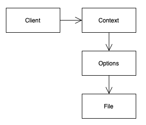
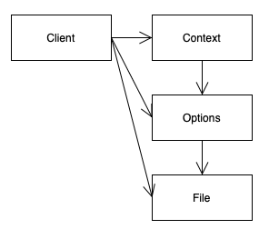

# 6장 객체와 자료구조

## 자료 추상화

```java
public class Point {
    public double x;
    public double y;
}

public interface Point {
    double getX();
    double getY();
    void setCartesian(double x, double y);

    double getR();
    double getTheta();
    void setPolar(double r, double theta);
}
```

어떤 한 점 Point를 표현하는데 있어 1번 케이스와 2번 케이스의 차이는 무엇일까?

우선 1번 케이스는 이 점이 직교좌표계를 사용하고 있다는것이 명백하다. 혹은 자바빈(bean) 스타일로 x와 y가 private 변수이고 각각 getter, setter가 설정되어 있다고 가정해본다면? 내부 변수에 접근하기 위해 함수 한 단계를 추가했다고 하더라도 사실상 public으로 열어둔 것과 근본적인 차이는 존재하지 않는다. 

반면 2번 케이스는 값의 설정/조회가 추상화 되어있다. 특히 설정 시에는 x와 y, r과 theta를 한번에 입력하도록 되어있다. 

### 추상적인 인터페이스

```java
public interface Vehicle {
    double getFuelTankCapacityInGallons();
    double getGallonsOfGasoline();
}

public interface Vehicle {
    double getPercentFuelRemaining();
}
```

탈것 인터페이스인 Vehicle의 예시도 생각해보자. 

1번 케이스는 차량의 남은 연료 값을 단순 조회 하는 기능을 제공한다. 

반면 2번 케이스는 남은 연료를 백분율로 조회한다. 단순 변수 값 조회보다 더욱 추상적인 정보를 제공하고 있다. 이렇듯 인터페이스는 추상적인 정보를 제공해야 한다.

## 디미터 법칙

**“최소한의 지식 원칙”, “Don’t talk to strangers”** 라고도 불리는 디미터 법칙은 자신이 조작하는 객체의 세부적인 내용을 몰라야 한다는 법칙이다. 이 말인 즉슨 객체가 조회 메서드(getter 메서드)로 자신의 내부 구조를 공개하면 안된다는 의미이다. 

이 법칙에 의하면 어떤 클래스 C의 메서드 f는 아래의 경우에 속하는 객체의 메서드만 호출해야 한다.

- 클래스 C
- 클래스 C의 멤버 객체
- f 안에서 생성한 객체
- f의 인자로 넘어온 객체

코드로 표현해보자.

```java
public class Clazz {
    private Foo foo;

    public void method1(Bar bar) {
        // method1 로직
        Baz baz = new Baz();
    }

    public void method2() {
        // method2 로직
    }
}

public class Foo {
    public void doFoo() {
        // 클래스 Foo의 메서드
    }
}

public class Bar {
    public void doBar() {
        // 클래스 Bar의 메서드
    }
}

public class Baz {
    public void doBaz() {
        // 클래스 Baz의 메서드
    }
}
```

위와 같은 어떤 클래스 Clazz가 있을때 Clazz의 메서드인 `method1()` 에서 호출할 수 있는 메서드는 

- `method2`
- `foo.doFoo()`
- `bar.doBar()`
- `baz.doBaz()`

로 제한된다.

주의해야할 점은 위에서 허용된 메서드가 반환한 제 3의 객체의 메서드(e.x. `Fie` 의 메서드 `doFie()`) 는 호출할 수 없다. 디미터 법칙의 또다른 이름이 **“Don’t talk to strangers”** 법칙인 이유이다. 

이 원칙을 지키면 객체의 동작에 반드시 필요한 객체들 만으로 관계를 한정지을 수 있어서 결과적으로 loose coupling을 달성할 수 있다.

예시를 보자. 

```java
public OutputStream getOutputStream() {
    String outputDir = ctxt.getOptions().getScratchDir().getAbsolutePath();
    String outFile = outputDir + "/" + className.replace('.', '/') + ".class";
    FileOutputStream fout = new FileOutputStream(outFile);
    return new BufferedOutputStream(fout);
}
```

위 코드를 사용하는 클라이언트는 파일 경로를 기반으로하는 `OutputStream` 을 생성하는것이 목적이었다. 그런데

1. ctxt에서 옵션 정보를 알아온 다음
2. 옵션 정보에서 scratch directory 를 가져와서
3. 절대경로 값을 알아온 다음
4. 경로와 클래스 이름으로 출력 파일 이름을 만들고
5. OutputStream을 생성하고 있다.

우선 위 코드가 디미터 법칙을 어기고 있는것은 명백하다. ctxt에서 객체 그래프를 계속 탐색하여 Options를 거쳐 Directory까지 접근하고 있기 때문이다. 객체간의 의존관계를 다이어그램으로 표현해보자.



그런데 과연 이렇게 아름다운 의존관계를 가질까? Client는 멤버변수로 Context만 들고 있을지 몰라도 Context에서 getOptions()를 통해 Options 인스턴스를 받아오고 있으며 Options에서 getScratchDir()을 통해 File 인스턴스를 받아온다. 즉 객체의 의존관계는 다음과 같이 다시 그려야 한다.



그럼 근본적으로 도대체 어떻게 해야 했을까? Context가 객체인 이상 바람직한 구조는 getter로 내부 구조를 드러내는것이 아니라 뭔가를 스스로 **하는(do)** 것이다. Client가 구구절절하게 디렉토리 경로와 파일 이름을 가지고 OutputStream을 만들어 낼 것이 아니라 Context가 OutputStream을 생성하여 Client에게 반환하도록 하는편이 낫다.

```java
public OutputStream getOutputStream() {
    return ctxt.createScratchFileStream(classFileName);
}
```

Client의 코드가 위와 같았다면 비로소 의존관계가 깔끔해진다.


### 체이닝

```java
public List<Integer> filter50AboveStream(List<Integer> list) {
    return list.stream()
            .map(integer -> integer * 10)
            .filter(integer -> integer >= 50)
            .collect(Collectors.toList());
}
```

위와 같은 스트림 체이닝은 과연 디미터 법칙을 위배할까? 언뜻 보기에는 여러 개의 .(dot) 를 사용하고 있기 때문에 디미터 법칙을 위배한 것처럼 보인다.

결론은 아니다. 디미터 법칙은 **객체간의 결합도**에 관한 법칙이다. getter를 통해 객체의 내부가 외부로 노출되는것을 지양해야 한다는 법칙이지 하나의 dot를 사용해야 한다는 법칙이 아니다. 스트림 중간처리 메서드는 새로운 스트림 객체를 반환하는 것이기 때문에 여러 개의 dot를 사용하더라도 객체간 결합도가 높아지지 않는다. 

## 추상화 수준 feat. Chapter3

3장에서 함수는 한 가지를 해야 한다고 배웠다. 또 추상화 수준이 하나라면 그 함수는 한 가지 작업만 하는 것이라고 했다. 

```java
public OutputStream getOutputStream() {
    String outputDir = ctxt.getOptions().getScratchDir().getAbsolutePath();
    String outFile = outputDir + "/" + className.replace('.', '/') + ".class";
    FileOutputStream fout = new FileOutputStream(outFile);
    return new BufferedOutputStream(fout);
}
```

이 코드는 디미터 법칙을 위배했을 뿐 아니라 사실 추상화 수준도 뒤섞인 코드이다. String 타입의 출력 파일 경로를 생성하는 코드와 이를 OutputStream으로 변환하는 코드가 모두 들어있기 때문이다. 심지어 첫 두 줄이 출력 파일 경로를 생성하는 코드였다는 사실을 한 눈에 파악하기조차 어렵다. 디미터 법칙은 차치하더라도 아래와 같이 추상화 수준을 맞춰주는 편이 낫다.

```java
public OutputStream getOutputStream() {
    String outFile = getOutputFilePath();
    FileOutputStream fout = new FileOutputStream(outFile);
    return new BufferedOutputStream(fout);
}

private String getOutputFilePath() {
    String outputDir = ctxt.getOptions().getScratchDir().getAbsolutePath();
    String outFile = className.replace('.', '/') + ".class";
    return outputDir + "/" + outFile;
}
```