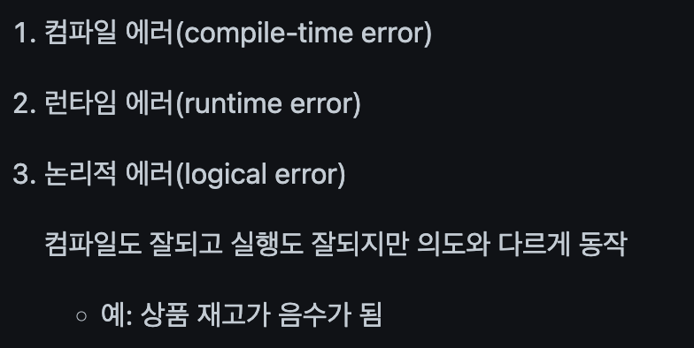

# [CleanCode] 7장 - Error Handling

# Overview

> *프로그램이 잘못될 가능성은 늘 존재한다. 그 원인은 **Error(오류)**이다.*
> 

- 김모씨의 말을 빌리자면,,



### Error & Exception in Runtime

- Error (오류)
    - 시스템이 종료되어야 할 수준의 심각한 상황 (프로세스 종료)
    - 미리 예측하여 방지 불가
    - ex) OutOfMemoryError, StackOverflowError
- Exception (예외)
    - 개발자가 구현한 로직에서 발생하거나 사용자에 의해 발생
    - 개발자가 미리 방지 가능
    
    ```kotlin
    data class Person(val name: String, val age: Int)
    
    // 1. What Exception?
    fun main(args: Array<String>) {
    		var person: Person? = null
    		val age: Int? = person!!.age
    		println(age)
    }
    
    // 2. What Exception?
    open class Animal {}
    class Dog: Animal() {}
    class Cat: Animal() {}
    
    fun main(args: Array<String>) {
    		val dog = Dog()
    		val cat = dog as Cat
    }
    ```
    

> *상황에 맞는 Exception Handle을 해야한다.*
> 


### Exception Class

- Throwable
    - Error / Exception에 대한 메세지를 담고, Chained Exception에 대한 정보들을 기록
        
        The `Throwable` class is the **superclass of all errors and exceptions** in the Java language. Only objects that are instances of this class (or one of its subclasses) are thrown by the **Java Virtual Machine or can be thrown by the Java `throw` statement.** Similarly, only this class or one of its subclasses can be the argument type in a `catch` clause. For the purposes of compile-time checking of exceptions, `Throwable` and any subclass of `Throwable` that is not also a subclass of either `[RuntimeException](https://docs.oracle.com/en/java/javase/14/docs/api/java.base/java/lang/RuntimeException.html)` or `[Error](https://docs.oracle.com/en/java/javase/14/docs/api/java.base/java/lang/Error.html)` are regarded as checked exceptions …
        
    - `Throwable(String message, Throwable cause)`

- Java

```java
throw new Exception("Error Message")
```

- Kotlin

```java
throw Exception("Error Message")
```

- 호출한 곳에 Exception 발생 여부 통보

```kotlin
void method() throws Exception1, Exception2 {
  //...
}
```

---

# 오류 코드보다 예외를 사용하기

<aside>
🌱 로직과 Exception 처리를 분리하기

</aside>

- 로직과 오류 처리 코드가 뒤섞여 있다.

```java
public class DeviceController {

    **public void sendShutDown() {**
        DeviceHandle handle = getHandle(DEV1);

        // 디바이스 상태를 점검한다.
        if (handle != DeviceHandle.INVALID) {

            // 레코드 필드에 디바이스 상태를 저장한다.
            retrieveDeviceRecord(handle);

            //디바이스가 일시정지 상태가 아니라면 종료한다.
            if (record.getStatus() != DEVICE_SUSPENDED) {
                pauseDevice(handle);
                clearDeviceWorkQueue(handle);
                closeDevice(handel);
            } else {
                logger.log("Device suspended. Unable to shut down");
            }
        } else {
            logger.log("Invalid handle for: " + DEV1.toString());
        }
    }
}
```

- 오류를 발견하면 예외를 던진다.

```java
public class DeviceController {

    **public void sendShutDown() {**
        try {
            tryToShutDown();
        } catch (DeviceShutDownError e) {
            logger.log(e);
        }
    }
 
    private void tryToShutDown() throws DeviceShutDownError {
        DeviceHandle handle = getHandle(DEV1);
        **DeviceRecord record = retrieveDeviceRecord(handle);**
 
        pauseDevice(handle);
        clearDeviceWorkQueue(handle);
        closeDevice(handle);
    }
 
    private DeviceHandle getHandle(DeviceId id) {
        ...    	
        **throw new DeviceShutDownError("Invalid handle for:" + id.toString());**
        ...
    }
}
```

---

# Try-Catch-Finally

- try-catch-finally

```kotlin
try {
    // Exception 발생이 예상되는 코드 블록
} catch (e: Exception) {
    // Exception이 발생했을 때 실행되는 블록
} finally {
    // Exception 발생과 상관없이 무조건 실행되는 블록
}
```

- 숫자를 0으로 나누면,,

```kotlin
int c = 4 / 0;

// Exception in thread "main" java.lang.ArithmeticException:
```

- 예외 처리

```kotlin
int c;
try {
    c = 4 / 0;
} catch **(ArithmeticException e)** {
    c = -1;  // 예외가 발생하여 수행되는 코드
}
```

- 예외가 발생하더라도 반드시 실행되어야 한다면,,

```kotlin
public void shouldBeRun() {
      System.out.println("ok thanks.");
}

public static void main(String[] args) {
      Sample sample = new Sample();
      int c;
      try {
          c = 4 / 0; // exception !!
          sample.shouldBeRun(); 
      } catch (ArithmeticException e) {
          c = -1;
      }
}

// finally 
public static void main(String[] args) {
        Sample sample = new Sample();
        int c;
        try {
            c = 4 / 0;
        } catch (ArithmeticException e) {
            c = -1;
        } finally {
            sample.shouldBeRun();  // 예외에 상관없이 무조건 수행.
        }
}
```

- [Q] try-catch와 return 값
    - 어떤 구문에 있는 값이 반환될까?
    
    ```kotlin
    String getTryCatch() {
    
      String word = "do";
    
      try {
    
    		  word = "try";
    	  	System.out.println(word);
    	  	return word;
      } catch (Exception e) {
    
      		word = "catch";
      		System.out.println(word);
      		return word;
      } finally {
    
      		word = "finally"
      		System.out.println(word);
      		return word;
      }
    }
    
    // 최종 리턴값
    
    ```
    
    - return 값을 조작?
    
    ```kotlin
    String getTryCatch() {
    
      String word = "do";
    
      try {
    
    		  word = "try";
    	  	System.out.println(word);
    	  	return word;
      } catch (Exception e) {
    
      		word = "catch";
      		System.out.println(word);
      		return word;
      } finally {
    
      		word = "finally"
      		System.out.println(word);
      		// return word;
      }
    }
    
    // 최종 리턴값
    ```
    
    - 메모리에 직접 접근한다면
    
    ```kotlin
    String getTryCatch() {
    
      String arr = { "none", "none", "none" }
    
      try {
    
    		  arr[0] = "first";
    	  	return arr;
      } catch (Exception e) {
    
      		arr[1] = "second";
      		return arr;
      } finally {
    
      		arr[2] = "third"
      		// return arr[2];
      }
    }
    
    // 최종 리턴값
    // ?
    ```
    
    > *finally 에서의 리턴은 자제하자*
    > 
    

1. 파일이 없으면 예외를 던지는지 알아보는 단위 테스트

```kotlin
@Test(expected = StorageException.class)
public void retrieveSectionShouldThrowOnInvalidFileName() {
    sectionStore.retrieveSection("invalid - file");
}
```

1. 아래 코드는 테스트가 성공할까?

```kotlin
public List<RecordedGrip> retrieveSection(String sectionName) {
    // 실제로 구현할 때까지 비어 있는 더미를 반환
    return new ArrayList<RecordedGrip>();
}
```

1. Exception을 던지자

```kotlin
public List<RecordedGrip> retrieveSection(String sectionName) {
    try {
        FileInputStream stream = new FileInputStream(sectionName);
    } catch (Exception e) {
        throw new StorageException("retrieval error", e);
    }
    return new ArrayList<RecordedGrip>();
}
```

1. 예외 유형을 좁히자

```kotlin
public List<RecordedGrip> retrieveSection(String sectionName) {
    try {
        FileInputStream stream = new FileInputStream(sectionName); 
        stream.close();
    } **catch (FileNotFoundException e)** 
        throw new StorageException("retrieval error", e);
    }
    return new ArrayList<RecordedGrip>();
}
```

- ex)

```kotlin
try {
  loginApiClient.login(request) 	
} catch (e: LoginException) {
  if (e.errorCode == "INVALID_PASSWORD") {
    return null
  } else {
    throw e
  }
}
```

- runCatching

```kotlin
return runCatching {
  loginApiClient.login(request)
}.onFailure { e -> 
  if (e.errorCode != "INVALID_PASSWORD") throw e
}.getOrNull()
```

- kotilnx.runCatching

```kotlin
@InlineOnly
@SinceKotlin("1.3")
public inline fun <R> runCatching(block: () -> R): Result<R> {
  return try {
    **Result.success(block())**
  } catch (e: Throwable) {
    **Result.failure(e)**
  }
}
```

- Exception은 크게 3가지 형태로 처리 가능
    - 회피 : 호출한 쪽으로 그대로 전달 (throw)
    
    ```kotlin
    // 회피
    fun exceptionTest(): Nothing {
        throw IOException("exception")
    }
    ```
    
    - 복구 : 복구 또는 무시 가능한 경우에 catch 블럭 내에서 처리하거나 예외상황 처리후 에러 코드 반환
    
    ```kotlin
    // 복구
      fun exceptionTest(): String {
          return try {
              "NoException"
          } catch (e: Exception) {
              "Exception"
          }
      }
    ```
    
    - 전환 : 특정 Exception으로 변환하여 전달 (throw)
    
    ```kotlin
    // 전환
    fun exceptionTest(): String {
          return try {
              "NoException"
          } catch (e: NullPointerException) {
              throw CustomException
          }
    }
    ```
    

---

# Unchecked Exception을 사용하기


- `CheckedException`
    - 단순 예외, 즉 컴파일 시 발생하는 Exception
    - 프로그램 작성 시 이미 예측 가능
    - 반드시 예외처리 해야함
- `UnCheckedException`
    - 프로그램 실행시 발생하는 Runtime Exception
    - 명시적 처리를 요구하지 X

> RuntimeException을 상속받는 Exception → *Unchecked Exception*
> 
- **Kotlin의 모든 Exception은 Runtime Exception을 상속받는다.**

- UnCheckedException을 사용해보자

```kotlin
class FoolException extends **RuntimeException** {

}

public void sayNickname(String nickname) {
        if(nickname.equals("fool")) {
            throw new FoolException();
        }
        System.out.println("당신의 별명은 "+nickname+" 입니다.");
}

public static void main(String[] args) 
        sayNickname("fool"); // Exception in thread "main" FoolException
        sayNickname("genious");
}
```

- Checked Exception을 사용해보면?
    - 컴파일 오류
    - 예측 가능한 CheckedException → 예외처리 강제

```kotlin
class FoolException extends **Exception** {

}
```

- 컴파일 오류를 막기위한 예외 처리

```kotlin
public void sayNickname(String nick) {
        try {
            if(nick.equals("fool")) {
                throw new FoolException();
            }
            System.out.println("당신의 별명은 "+nick+" 입니다.");
        } catch (FoolException e) {
            System.err.println("Fool Exception 발생");
        }
}
```

- sayNickname 메서드에서 예외 발생 & 예외 처리 모두 하는 것?
    - sayNickname을 호출한 곳에서 예외 처리를 한다면? ✨

```kotlin
// callee
public void sayNickname(String nickname) **throws FoolException {**
        if(nickname.equals("fool")) {
            throw new FoolException();
        }
        System.out.println("당신의 별명은 "+nickname+" 입니다.");
}

// caller
public static void main(String[] args) {
        try {
            sayNickname("fool");
            sayNickname("genious");
        } **catch (FoolException e) {
            System.err.println("Fool Exception 발생");
        }**
}
```

- sayNickname에서 예외 처리 vs main에서 예외처리

```kotlin
sayNickname("fool");
sayNickname("genious");
```

- ***Exception을 처리하는 위치는 중요하다.***

in Clean Code,,

- Checked Exception은 비용이 있다!

<aside>
🌱 Checked Exception은 **OCP(Open-Closed Principle)를 위반한다.**

</aside>

- 단순 출력 로직

```kotlin
fun callee(flag: Boolean) {
    if (flag) println("호출당했어!")
}

fun caller(flag: Boolean) {
    callee(flag)
}
```

- 출력을 안하는 Exception을 던질 때
    - 하위 단계 코드 변경 → 상위 단계 코드 변경
        - 모두 `catch` 블록에서 처리
        - 선언부에 `throws` 절 추가

```kotlin
fun callee(flag: Boolean) throws NotPrintException {
    if (flag) {
			println("호출당했어!") 
		}
		else {
			throw NotPrintException()
		}
}

fun caller(flag: Boolean) **throws NotPrintException** {
    callee(flag)
}
```

<aside>
🌱 Checked Exception은 **캡슐화를 깰 수 있다.**

</aside>

---

# Exception에 의미를 제공하기

<aside>
🌱 오류가 발생한 **원인과 위치**를 찾을 수 있어야 한다.

</aside>

- stacktrace 활용
- **message에 유의미한 정보를 담아서 던지기**
    - 실패한 연산 이름, 실패 유형 언급
- Logging 가능 → catch 블록에서 오류 기록

```java
// ...
throw new IllegarArgumentException();

// ...
throw new InvalidSearchArgumentException("검색 조건은 빈칸일 수 없습니다.");
```

---

# Exception Class 정의하기

- 호출자(Caller)를 고려해서 Exception을 정의할 수 있다.

```kotlin
/**
 * + 앱에서 발생하는 클라이언트 및 서버 에러 정보
 * + [message] 메세지
 * + [cause] 원인이 되는 익셉션
 */
class MyException(
    message: String? = null,
    cause: Throwable? = null
): Exception(message, cause) {
    /**
     * 에러 코드 [ErrorCode]
     */
    var errorCode: Int = ErrorCode.UNKNOWN_ERROR
        private set

    /**
     * 사용자에게 서버 에러 메세지 표시가 필요한 경우 값을 가진다.
     */
    var serverAlert: ErrorMessage? = null
        private set

    data class ErrorMessage(val code: Int, val message: String)

    companion object {
        /**
         * 사용자 고지가 필요한 서버 에러 정보를 포함한 Exception 생성
         */
        fun alertOf(code: Int, message: String? = null): MyException {
            return MyException().apply {
                errorCode = ErrorCode.SERVER_ALERT_ERROR
                serverAlert = ErrorMessage(code = code, message = message ?: "")
            }
        }

        /**
         * 일반적인 서버 에러로 부터 Exception 생성
         */
        fun serverErrorOf(code: Int, message: String? = null): MyException {
            val error = ErrorCode.parseServerError(code)
            return MyException(message).apply {
                errorCode = error
            }
        }

        /**
         * 원인 익셉션으로 Exception 생성
         */
        fun exceptionOf(cause: Exception, message: String? = null): MyException {
            val error = ErrorCode.parseException(cause)
            return MyException(
                message = message ?: cause.message,
                cause = cause
            ).apply {
                errorCode = error
            }
        }
    }
}
```

---

# 정상 흐름을 정의하기

- 총계를 계산하는 로직
    - 식비를 비용으로 청구 → 청구한 식비를 더함
    - 청구 X → 일일 기본 식비를 더함

```java
try {
		MealExpenses expenses = expenseReportDAO.getMeals(employee.getID());
		m_total += expenses.getTotal();
} catch (MealExpenseNotFound e) {
		m_total += getMealPerDiem();
}
```

- 특수한 Exception이 있을 상황이 아니다.

```java
MealExpenses expenses = expenseReportDAO.getMeals(employee.getID());
**m_total += expenses.getTotal();**
```

- DAO를 수정 → 항상 MealExpense 객체를 반환

```java
public class PerDiemMealExpenses implements MealExpenses {
		public int getTotal() {
			// 일일 기본 식비를 더하도록
		}
}
```

- **Special Case Pattern (특수 사례 패턴)**
    - 클래스 or 객체를 조작해서 특수한 사례를 처리
    - 클래스 내에서 예외적인 상황을 캡슐화

---

# Null을 반환하지도, 전달하지도 마라

- Null 반환
    - null 반환 대신 예외를 던지기
    - 특수 Wrapper 객체로 감싸서 반환

```java
public void registerItem(Item item) {
		if (item != null) {
				ItemRegistry registry = peristentStore.getItemRegistry();
				if (registry != null) {
						Item existing = registry.getItem(item.getID());
						if (existing.getBillingPeriod().hasRetailOwner()) {
								existing.register(item);
						}
				}
		}
}
```

- 직원 리스트를 가져와서 총 급여를 구하는 로직

```java
List<Employee> employees = getEmployees();
 
**if (employees != null) {**
    for(Employee e : employees) {
        totalPay += e.getPay();
    }
}
```

- null 반환 대신 빈 리스트를 반환하기

```java
List<Employee> employees = getEmployees();
 
for(Employee e : employees) {
    totalPay += e.getPay();
}

// Colections.emptyList() 활용
public List<Employee> getEmployees() {
		if (/* 직원이 없다면 */) {
				return **Collections.emptyList();**
		}
}
```

- Null 전달

> 메서드가 *null을 반환하는 방식도 나쁘지만, 메서드에 **null을 전달하는건 더 나쁘다.***
> 

- 두 지점 사이의 거리를 구하는 메서드

```java
public double xProjection(Point p1, Point p2) {
    return (p2.x - p1.x) * 1.5
}
```

- 인수로 null을 전달하면?

```java
calculator.xProjection(null, new Point(2, 3));
```

- 예외를 만들어 던지기
    - Exception을 잡아내는 처리기가 필요

```java
public double xProjection(Point p1, Point p2) {
    if (p1 == null || p2 == null) {
        throw InvalidArgumentException("Invalid Point");
    }
    return (p2.x - p1.x) * 1.5
}
```

- assert
    - 여전히 오류 발생

```java
public double xProjection(Point p1, Point p2) {
    assert p1 != null : "p1 should not be null";
		assert p2 != null : "p2 should not be null";
		return (p2.x - p1.x) * 1.5;
}
```

<aside>
🌱 *애초에 null을 넘기지 못하게 하라*

</aside>

---

# 결론

- 명시적 Exception은 반드시 이름을 지정하여 catching
- 어플리케이션에서 구현한 함수 내에서 Exception 발생이 예상되는 경우
    - 최상위 Exception 클래스에서 반드시 catch 처리
    - Exception을 처리하는 궁극적인 위치가 중요.
- Exception 발생시에는 Crashlytics 와 같은 에러 로그 라이브러리 등을 이용하여 개발자가 인지할 수 있도록 하기
