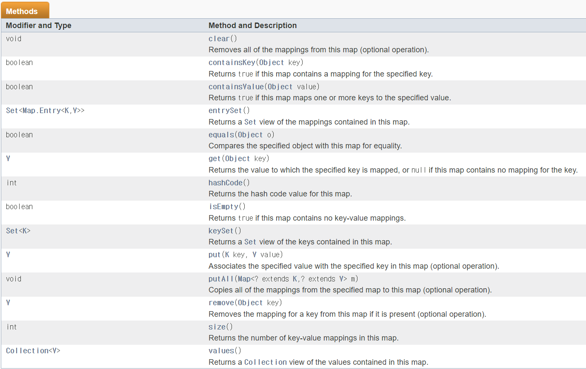
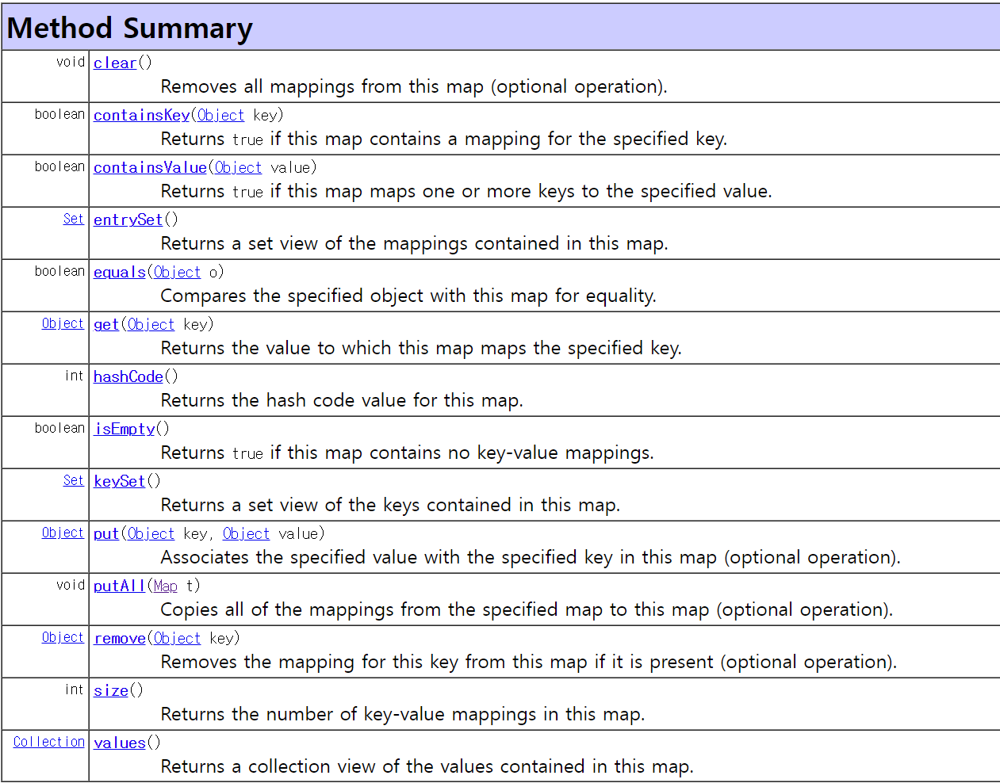
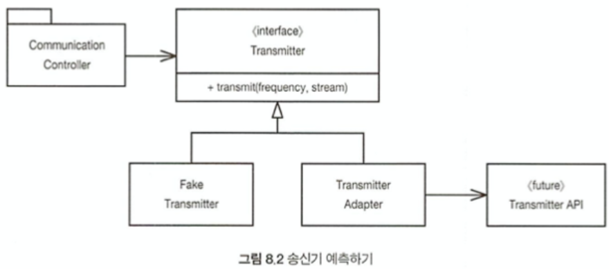
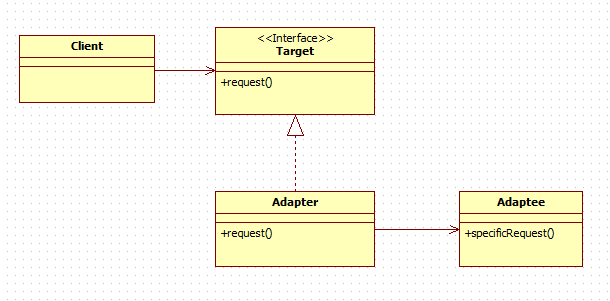

# [클린코드] 8. 경계

## 개요

> 개발 혼자 하나 패키지 가져오고 오픈소스 끌어다 쓰고 다른 팀꺼 가져다 쓴다

> 외부 코드 깔끔하게 통합해야 되는데 소프트웨어의 경계를 깔끔하게 처리하는 방법

## 외부 코드 사용하기

- 인터페이스, 프레임워크들은 적용성, 범용성을 높이고 싶다.
- 사용자들은 나에게만 집중하는 인터페이스를 바란다.

- java.util.Map의 인스턴스를 여기저기 넘기는 상황을 생각해보자

  

  첫 메소드부터 clear()다. 인스턴스를 가진 누구나 내용을 삭제 할 수 있다.

  제네릭을 사용할 수도 있다.

  하지만 Map 인터페이스가 수정된다면?

  

  자바5에 제네릭이 도입되면서 Map 인터페이스도 변했다.

  그럼 Map을 사용하는 코드를 수정해야 한다.

  그러므로 경계 인터페이스인 Map을 숨겨서 나머지에는 영향을 끼치지 않도록 해야한다.

  숨기고 나면 내가 원하는 기능만 제공하도록 제어할 수 있다.

  ```java
  Map sensors = new HashMap();
  Sensor s = (Sensor)sensors.get(sensorId);

  Map<String, Sensor> sensors = new HashMap<Sensor>();
  Sensor s = sensors.get(sensorId);

  public class Sensors {
    private Map sensors = new HashMap();

    public Sensor getById(String id) {
      return (Sensor) sensors.get(id);
    }
  }
  ```

여기서 캡슐화가 중요한게 아니고 경계 인터페이스를 여기저기 넘기지 않는 것이 중요하다.

## 경계 살피고 익히기

- 외부 코드를 가져다 쓰면서 우리 코드도 작성하면
  외부 코드 익히기와 통합하기를 동시에 하는 어려움이 생긴다.
- 일단 간단한 테스트 케이스를 작성해 외부 코드를 익히자 → `학습 테스트`
- 학습 테스트
  - 외부에서 만든 소프트웨어를 그냥 바로 사용하는 대신 API가 우리 예상대로 실행된다는 것을 확인하는 테스트
  - 다양한 조건, 기능들을 확인해봄으로서 외부 코드개발에 도움이 됨
  - 외부 코드가 변경될 때 호환성 검증 가능 → 유지보수 가능

## log4j 익히기

## 학습 테스트는 공짜 이상이다

## 아직 존재하지 않는 코드를 사용하기

- 아는 코드와 모르는 코드 사이의 경계
- 
  우리가 모르는 transmitter라는 시스템이 있지만 아직 설계되지 않았다.
  필요한 기능을 정의 하는 인터페이스를 만든다
  우리가 만든 인터페이스니까 구현하기 편하고 통제도 가능하다
  Fake transmitter를 두어 테스트도 가능하다.

## 깨끗한 경계

- 경계에서는 변경이 자주 일어난다.
- 경계에서는 코드를 깔끔히 분리한다.
  - 원하는 기능에 대한 테스트
  - 우리가 만든 코드에 의존
- 해결
  - 새로운 클래스, 인터페이스로 경계를 감싸기
  - Adapter 패턴
    - 인터페이스를 클라이언트에 맞게 다른 인터페이스로 변환
    - 클라이언트는 호환되지 않는 인터페이스를 사용할 수 있고 인터페이스가 변경되더라도 클라이언트는 변경될 필요가 없다.
      
